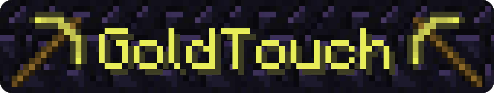

# GoldTouch - Silk Touch for gold tools

GoldTouch is a configurable CB1060 server plugin that makes all gold tools have silk touch.

## Installation

Download the [latest release GoldTouch.jar](https://github.com/obsidianlad/GoldTouch/releases/latest) and put it in the `plugins/` folder of your CB1060 server. 

## Configuration

### Permissions

GoldTouch comes with a single permission, which is true by default:

```yml
permissions:
  goldtouch.use:
    default: true
    description: Is able to use GoldTouch.
```

### Ignore blocks

GoldTouch can be configured to ignore specific blocks. 
This is useful for server admins that don't want players to have specific blocks, like mob spawners.

By default, GoldTouch will create its own `plugins/GoldTouch/config.yml` with the following defaults:

```yml
ignore:
- BEDROCK
- PISTON_BASE
- PISTON_STICKY_BASE
- PISTON_EXTENSION
- PISTON_MOVING_PIECE
- MOB_SPAWNER
- LOCKED_CHEST
- DIODE_BLOCK_ON
- WOODEN_DOOR
- IRON_DOOR_BLOCK
- CAKE_BLOCK
- CROPS
- BURNING_FURNACE
- AIR
- WATER
- STATIONARY_WATER
- LAVA
- STATIONARY_LAVA
- FIRE
- PORTAL
```

A server admin may configure this however they like. See [Materials.java](https://github.com/Bukkit/Bukkit/blob/da29e0aa4dcb08c5c91157c0830851330af8b572/src/main/java/org/bukkit/Material.java#L14) for block names.

## Building

To build from source you will need a CB1060 jar and Java 8.

Then, simply

```bash
$ javac -cp path/to/cb1060.jar:. GoldTouch.java
```

This will give you a compiled GoldTouch.class.

Then you will have to pack your own GoldTouch.jar with the following folder structure:

```
GoldTouch.jar
├── lad/
│     └── obsidian/
│           └── goldtouch/
│                 └── GoldTouch.class
└── plugin.yml
```
